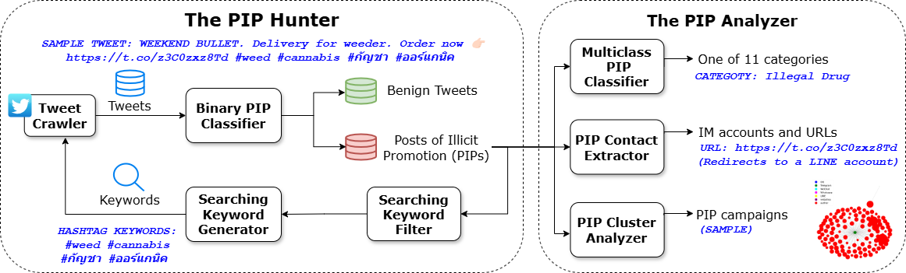

# Illicit-Promotion-on-Twitter

This is the repository that contains source code for the project [Illicit Promotion on Twitter](http://pepper.chaselabs.org:8000/).

Methodology overview:

Directory structure:

├── README.md

└── code

    ├── PIP_Analyzer

    │   ├── Multiclass_PIP_Classifier/

    │   └── PIP_Contact_Extractor/
    
    ├── PIP_Hunter

    │   ├── Binary_PIP_Classifier/

    │   ├── Searching_Keyword_Generator/

    │   └── TweetCrawler/

    └── methodology_overview.png